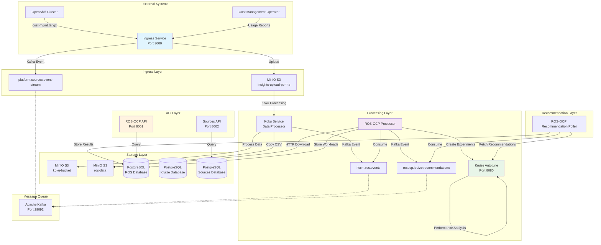

# ROS-OCP Backend Data Flow Documentation

## Overview

The Resource Optimization Service for OpenShift Container Platform (ROS-OCP) backend processes workload usage data to provide performance optimization recommendations. This document describes the complete data flow from ingestion to recommendation generation.

## Data Flow Architecture



## Component Responsibilities

### 1. Ingress Service
**Purpose**: Receives and validates uploaded cost management data
- **Port**: 3000
- **Input**: Multipart file uploads (cost-mgmt.tar.gz, CSV files)
- **Output**: Files stored in MinIO `insights-upload-perma` bucket
- **Kafka**: Publishes events to `platform.sources.event-stream` topic

**Testing**:
```bash
# Health check
curl -f http://localhost:3000/api/ingress/v1/version

# Upload test file
curl -X POST \
  -F "file=@cost-mgmt.tar.gz" \
  -H "x-rh-identity: base64_encoded_identity" \
  -H "x-rh-request-id: test-request-123" \
  http://localhost:3000/api/ingress/v1/upload
```

### 2. Koku Service (Simulated in Test)
**Purpose**: Processes cost management data and prepares for ROS-OCP analysis
- **Input**: Files from `insights-upload-perma` bucket
- **Processing**: Extracts and transforms CSV data
- **Output**: Structured CSV files in `ros-data` bucket
- **Kafka**: Publishes events to `hccm.ros.events` topic

**Note**: In the test environment, this service is simulated by copying `ros-ocp-usage.csv` to the `ros-data` bucket.

### 3. ROS-OCP Processor
**Purpose**: Processes workload data and creates performance experiments
- **Input**: Kafka events from `hccm.ros.events` topic
- **Processing**:
  - Downloads CSV files via HTTP from MinIO
  - Validates CSV format (37 required columns)
  - Stores workload data in PostgreSQL
  - Creates experiments in Kruize Autotune
- **Output**: Workload records and experiment creation

**CSV Format Requirements**:
```csv
report_period_start,report_period_end,interval_start,interval_end,container_name,pod,owner_name,owner_kind,workload,workload_type,namespace,image_name,node,resource_id,cpu_request_container_avg,cpu_request_container_sum,cpu_limit_container_avg,cpu_limit_container_sum,cpu_usage_container_avg,cpu_usage_container_min,cpu_usage_container_max,cpu_usage_container_sum,cpu_throttle_container_avg,cpu_throttle_container_max,cpu_throttle_container_sum,memory_request_container_avg,memory_request_container_sum,memory_limit_container_avg,memory_limit_container_sum,memory_usage_container_avg,memory_usage_container_min,memory_usage_container_max,memory_usage_container_sum,memory_rss_usage_container_avg,memory_rss_usage_container_min,memory_rss_usage_container_max,memory_rss_usage_container_sum
```

**Testing**:
```bash
# Check processor logs
podman-compose logs rosocp-processor

# Verify database records
podman exec db-ros_1 psql -U postgres -c "SELECT COUNT(*) FROM workloads;"
```

### 4. Kruize Autotune
**Purpose**: Provides machine learning-based performance optimization recommendations
- **Port**: 8080
- **Input**: Experiment creation requests from ROS-OCP Processor
- **Processing**: Analyzes workload patterns and resource utilization
- **Output**: Performance recommendations and optimization suggestions

**Testing**:
```bash
# Health check
curl -f http://localhost:8080/listPerformanceProfiles

# List experiments
curl http://localhost:8080/listExperiments

# Get recommendations
curl "http://localhost:8080/listRecommendations?experiment_name=EXPERIMENT_NAME"
```

### 5. ROS-OCP Recommendation Poller
**Purpose**: Fetches recommendations from Kruize and stores them
- **Input**: Kafka events from `rosocp.kruize.recommendations` topic
- **Processing**:
  - Polls Kruize for recommendation updates
  - Processes recommendation data
  - Stores recommendations in PostgreSQL
- **Output**: Recommendation records in database

### 6. ROS-OCP API
**Purpose**: Provides REST API access to workload data and recommendations
- **Port**: 8001
- **Endpoints**:
  - `/status` - Health check
  - `/api/ros/v1/workloads` - Workload data
  - `/api/ros/v1/recommendations` - Optimization recommendations

**Testing**:
```bash
# Health check
curl -f http://localhost:8001/status

# List workloads
curl http://localhost:8001/api/ros/v1/workloads

# Get recommendations
curl http://localhost:8001/api/ros/v1/recommendations
```

### 7. MinIO S3 Storage
**Purpose**: Object storage for files and data persistence
- **Port**: 9000 (API), 9990 (Console)
- **Buckets**:
  - `insights-upload-perma`: Raw uploaded files
  - `insights-upload-perm`: Processed uploads
  - `koku-bucket`: Koku service data
  - `ros-data`: ROS-OCP processor input files

**Testing**:
```bash
# Health check
curl -f http://localhost:9000/minio/health/live

# List bucket contents (using mc client)
podman exec minio_1 /usr/bin/mc ls myminio/ros-data/

# Access via web console
open http://localhost:9990
```

### 8. Apache Kafka
**Purpose**: Message queue for event-driven communication
- **Port**: 29092
- **Topics**:
  - `platform.sources.event-stream`: Ingress events
  - `hccm.ros.events`: ROS processing events
  - `rosocp.kruize.recommendations`: Recommendation events

**Testing**:
```bash
# List topics
podman exec kafka_1 kafka-topics --list --bootstrap-server localhost:29092

# Consume messages
podman exec kafka_1 kafka-console-consumer \
  --bootstrap-server localhost:29092 \
  --topic hccm.ros.events \
  --from-beginning

# Produce test message
echo '{"test": "message"}' | podman exec -i kafka_1 kafka-console-producer \
  --broker-list localhost:29092 \
  --topic hccm.ros.events
```

## Network Architecture

### Container Network Communication
Services communicate using container network hostnames:
- **MinIO Access**: `http://minio:9000` (not `localhost:9000`)
- **Kafka Access**: `kafka:29092`
- **Database Access**: `db-ros:5432`, `db-kruize:5432`, `db-sources:5432`

### External Access Points
- **Ingress API**: `http://localhost:3000`
- **ROS-OCP API**: `http://localhost:8001`
- **Kruize API**: `http://localhost:8080`
- **Sources API**: `http://localhost:8002`
- **MinIO Console**: `http://localhost:9990`

## Data Flow Steps

### 1. Data Ingestion
1. OpenShift cluster uploads `cost-mgmt.tar.gz` to Ingress Service
2. Ingress validates and stores file in `insights-upload-perma` bucket
3. Ingress publishes event to `platform.sources.event-stream` topic

### 2. Data Processing (Koku Simulation)
1. Koku service processes uploaded files
2. Extracts and transforms CSV data to ROS-OCP format
3. Stores processed CSV in `ros-data` bucket
4. Publishes processing event to `hccm.ros.events` topic with file URLs

### 3. Workload Analysis
1. ROS-OCP Processor consumes events from `hccm.ros.events`
2. Downloads CSV files via HTTP from MinIO (`http://minio:9000/ros-data/...`)
3. Validates CSV format (37 columns required)
4. Stores workload data in PostgreSQL
5. Creates performance experiments in Kruize Autotune

### 4. Recommendation Generation
1. Kruize analyzes workload patterns and resource utilization
2. Generates performance optimization recommendations
3. ROS-OCP Recommendation Poller fetches updates
4. Stores recommendations in PostgreSQL

### 5. API Access
1. ROS-OCP API provides access to workload data and recommendations
2. External clients query optimization data via REST API

## Testing the Complete Data Flow

### Automated Testing
Use the comprehensive test script:
```bash
cd deployment/docker-compose/
./test-ros-ocp-dataflow.sh
```

The test script performs:
1. **Service Startup**: Starts all services with podman-compose
2. **Health Checks**: Verifies all services are ready
3. **Upload Test**: Simulates file upload to ingress
4. **Koku Simulation**: Copies correct CSV format to ros-data bucket
5. **Event Publishing**: Sends Kafka event with container network URLs
6. **Verification**: Checks processing, database storage, and recommendations

### Manual Testing Steps

1. **Start Services**:
```bash
export INGRESS_PORT=3000
export MINIO_ACCESS_KEY=minioaccesskey
export MINIO_SECRET_KEY=miniosecretkey
podman-compose up -d
```

2. **Upload Test Data**:
```bash
curl -X POST \
  -F "file=@samples/cost-mgmt.tar.gz" \
  -H "x-rh-identity: eyJpZGVudGl0eSI6eyJhY2NvdW50X251bWJlciI6IjEyMzQ1IiwiaW50ZXJuYWwiOnsib3JnX2lkIjoiMTIzNDUifX19" \
  -H "x-rh-request-id: test-request-123" \
  http://localhost:3000/api/ingress/v1/upload
```

3. **Simulate Koku Processing**:
```bash
# Copy correct CSV format to ros-data bucket
FILE_UUID=$(uuidgen | tr '[:upper:]' '[:lower:]')
CSV_FILENAME="${FILE_UUID}_openshift_usage_report.0.csv"
podman exec minio_1 /usr/bin/mc cp /dev/stdin myminio/ros-data/$CSV_FILENAME < samples/ros-ocp-usage.csv
```

4. **Publish Processing Event**:
```bash
# Create and send Kafka message
cat << EOF | podman exec -i kafka_1 kafka-console-producer --broker-list localhost:29092 --topic hccm.ros.events
{
  "request_id": "test-request-123",
  "b64_identity": "eyJpZGVudGl0eSI6eyJhY2NvdW50X251bWJlciI6IjEyMzQ1IiwidHlwZSI6IlVzZXIiLCJpbnRlcm5hbCI6eyJvcmdfaWQiOiIxMjM0NSJ9fX0=",
  "metadata": {
    "account": "12345",
    "org_id": "12345",
    "source_id": "test-source-id",
    "cluster_uuid": "1b77b73f-1d3e-43c6-9f55-bcd9fb6d1a0c",
    "cluster_alias": "test-cluster"
  },
  "files": [
    "http://minio:9000/ros-data/$CSV_FILENAME"
  ]
}
EOF
```

5. **Verify Processing**:
```bash
# Check processor logs
podman-compose logs rosocp-processor

# Check database records
podman exec db-ros_1 psql -U postgres -c "SELECT COUNT(*) FROM workloads;"

# Check Kruize experiments
curl http://localhost:8080/listExperiments
```

## Troubleshooting

### Common Issues

1. **Service Dependencies**: Ensure ingress depends on `minio` and `kafka`, not setup containers
2. **Network Connectivity**: Use container hostnames (`minio:9000`) not `localhost` in Kafka messages
3. **CSV Format**: Ensure CSV files have all 37 required columns for ROS-OCP processor
4. **File Accessibility**: Verify CSV files are accessible via HTTP from container network

### Debug Commands

```bash
# Check service status
podman-compose ps

# View service logs
podman-compose logs [service-name]

# Test container network connectivity
podman exec rosocp-processor_1 curl -I http://minio:9000/ros-data/file.csv

# Check MinIO bucket contents
podman exec minio_1 /usr/bin/mc ls myminio/ros-data/

# Monitor Kafka topics
podman exec kafka_1 kafka-console-consumer \
  --bootstrap-server localhost:29092 \
  --topic hccm.ros.events \
  --from-beginning
```

## Configuration Files

- **docker-compose.override.yml**: Service configuration and dependencies
- **deployment/docker-compose/test-ros-ocp-dataflow.sh**: Comprehensive testing script
- **samples/ros-ocp-usage.csv**: Correct CSV format for testing
- **samples/cost-mgmt.tar.gz**: Sample upload data

## Performance Considerations

- **Resource Allocation**: Ensure adequate CPU/memory for Kruize analysis
- **Database Connections**: Configure connection pools for high throughput
- **Kafka Partitions**: Scale topics based on message volume
- **MinIO Storage**: Monitor disk space for file storage