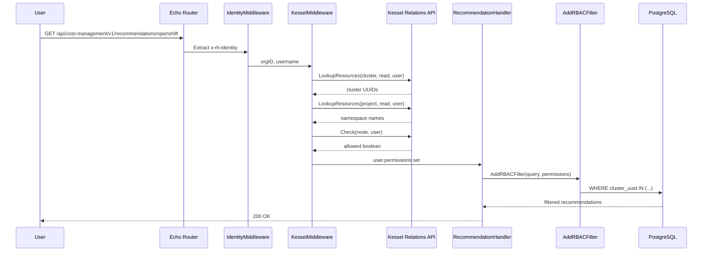
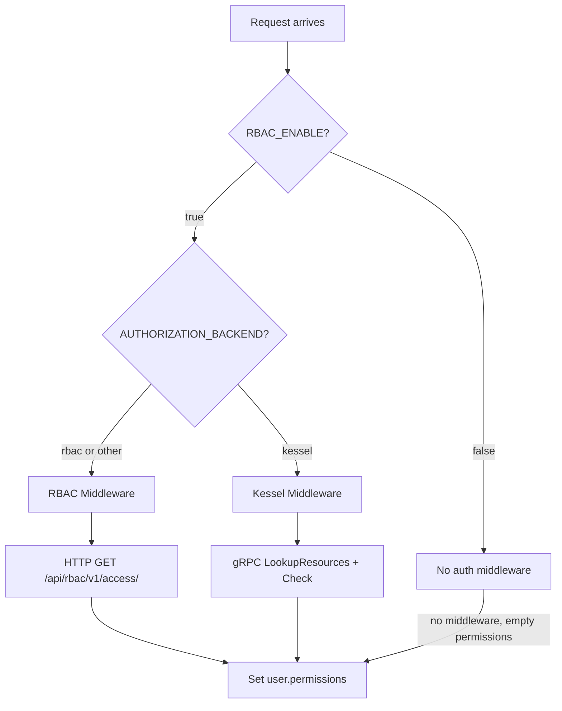

# Kessel/ReBAC Integration -- ROS OCP Backend

| Field         | Value                                                                 |
|---------------|-----------------------------------------------------------------------|
| Jira          | [FLPATH-3338](https://issues.redhat.com/browse/FLPATH-3338)          |
| Author        | Jordi Gil                                                             |
| Status        | Implemented                                                           |
| Created       | 2026-02-26                                                           |

## Table of Contents

1. [Overview](#1-overview)
2. [Authorization Model](#2-authorization-model)
3. [Implementation](#3-implementation)
4. [Configuration](#4-configuration)
5. [Query Builder Integration](#5-query-builder-integration)
6. [Resource Lifecycle](#6-resource-lifecycle)
7. [Testing Strategy](#7-testing-strategy)
8. [Dependencies](#8-dependencies)
9. [Risks and Mitigations](#9-risks-and-mitigations)

---

## 1. Overview

On-prem deployments require Kessel (a Relationship-Based Access Control system backed by
SpiceDB) for authorization. In SaaS, ROS calls the RBAC HTTP API; in on-prem, ROS calls
the Kessel Relations API. Both paths produce the same `user.permissions` shape so handlers
and query filters work identically regardless of backend.

ROS OCP Backend is a **read-only authorization consumer**. It never registers resources,
creates tuples, or manages roles. All authorization state is managed externally (by Koku
in the on-prem deployment). ROS only queries permissions at request time.

### Authorization Flow

1. User request arrives with `x-rh-identity` header
2. `IdentityMiddleware` extracts org ID and username
3. `KesselMiddleware` (or `Rbac` middleware, depending on config) resolves permissions
4. Handler reads `user.permissions` from Echo context
5. `AddRBACFilter` applies cluster/project filters to GORM query

### Scope

ROS handles three OCP resource types:

| ROS permission key | Kessel resource type | Usage |
|---|---|---|
| `openshift.cluster` | `cost_management/openshift_cluster` | Filter recommendations by cluster UUID |
| `openshift.node` | `cost_management/openshift_node` | Authorization gate only (no data filtering) |
| `openshift.project` | `cost_management/openshift_project` | Filter recommendations by namespace |

---

## 2. Authorization Model

### 2.1 Architecture

```mermaid
flowchart LR
    subgraph koku [Koku &#40;manages auth state&#41;]
        Reporter[ResourceReporter]
    end
    subgraph kessel [Kessel Stack]
        InventoryAPI[Kessel Inventory API]
        RelationsAPI[Kessel Relations API]
        SpiceDB[SpiceDB]
    end
    subgraph ros [ROS OCP Backend &#40;queries only&#41;]
        ROSMiddleware[KesselMiddleware]
        QueryBuilder[AddRBACFilter]
    end

    Reporter -->|"ReportResource (gRPC)"| InventoryAPI
    InventoryAPI --> SpiceDB
    RelationsAPI --> SpiceDB
    ROSMiddleware -->|"Check / LookupResources (gRPC)"| RelationsAPI
    ROSMiddleware --> QueryBuilder
```



| Responsibility | Owner |
|---|---|
| Resource registration, tuple seeding, role management | External (Koku in on-prem) |
| Authorization queries (per-request) | ROS (`KesselMiddleware`) |
| RBAC filter application (query layer) | ROS (`AddRBACFilter`) |

### 2.2 ZED Schema

The authorization model is defined in a ZED schema. The **source of truth** for the
production schema is [`RedHatInsights/rbac-config`](https://github.com/RedHatInsights/rbac-config).
A local copy for testing lives in [`dev/schema/schema.zed`](../../dev/schema/schema.zed).

**Local schema divergence from upstream:** The upstream schema defines cost management
permissions on `rbac/role` but does **not** define `cost_management/*` resource types
(e.g. `cost_management/openshift_cluster`). The local schema adds these resource types
with `t_workspace` relations and `read` permissions so that `LookupResources` can return
per-resource IDs. Until these definitions are added to the upstream schema, the local
`dev/schema/schema.zed` serves as the testing schema. The upstream only has `_read` and
`_all` permission variants on `rbac/role`; the local schema only defines `_read` since
ROS is a read-only consumer.

The permission hierarchy (read bottom-to-top for resolution):

```
cost_management/* resource ──[t_workspace]──► rbac/workspace
                                                 │
                                    ┌────────────┤
                                    ▼            ▼
                               [t_binding]   [t_parent]
                                    │            │
                                    ▼            ▼
                             rbac/role_binding  rbac/tenant
                              │          │         │
                         [t_granted] [t_subject] [t_default_binding]
                              │          │         │
                              ▼          ▼         ▼
                          rbac/role  rbac/principal  rbac/role_binding
                              │
                         [t_*_read]
                              │
                              ▼
                        rbac/principal
```

**Definitions:**

| Definition | Purpose |
|---|---|
| `rbac/principal` | A user identity |
| `rbac/group` | Group with `member` relation (supports nesting) |
| `rbac/role` | Defines which permissions exist (e.g. `cost_management_openshift_cluster_read`) |
| `rbac/role_binding` | Binds a subject (principal/group) to a role; permissions require both the role grant **and** subject membership (intersection `&`) |
| `rbac/workspace` | Organizational unit; inherits from parent workspace or tenant; aggregates bindings (union `+`) |
| `rbac/tenant` | Top-level org; has a default binding |
| `cost_management/openshift_cluster` | Resource type with `t_workspace` relation; `read` permission resolves through workspace hierarchy |
| `cost_management/openshift_node` | Same pattern as cluster |
| `cost_management/openshift_project` | Same pattern as cluster |

**How `LookupResources` resolves:**

Given a user and resource type (e.g. `cost_management/openshift_cluster`), the Relations
API walks: resource → `t_workspace` → workspace bindings → role → principal/group. It
returns all resource IDs where the `read` permission is satisfied.

**How `Check` resolves:**

Given a user and a tenant (e.g. `rbac/tenant:org-1`), the Relations API checks whether
the user has the specified permission (e.g. `cost_management_openshift_cluster_read`)
through the tenant's default binding chain.

### 2.3 Request Flow



> **Note:** The middleware iterates a Go map, so the order of LookupResources/Check calls
> is not guaranteed. The diagram shows a representative order.

### 2.4 Backend Selection



---

## 3. Implementation

### 3.1 PermissionChecker Interface

File: [`internal/kessel/client.go`](../../internal/kessel/client.go)

```go
type PermissionChecker interface {
    CheckPermission(ctx context.Context, orgID, permission, username string) (bool, error)
    ListAuthorizedResources(ctx context.Context, orgID, resourceType, permission, username string) ([]string, error)
}
```

`KesselClient` implements this interface using two gRPC clients from the Relations API
(`KesselCheckServiceClient` and `KesselLookupServiceClient`), both created from the
same gRPC connection in [`server.go`](../../internal/api/server.go).

- `CheckPermission` performs a tenant-level boolean check (`rbac/tenant:{orgID}`)
- `ListAuthorizedResources` streams `LookupResources` responses and collects resource IDs

### 3.2 Middleware

File: [`internal/api/middleware/kessel.go`](../../internal/api/middleware/kessel.go)

For each of the three permission types:

1. If the resource type supports per-resource listing (cluster, project): call
   `ListAuthorizedResources` first. If specific IDs are returned, use them.
2. On error or empty list, fall through to `CheckPermission` (tenant-level).
   If allowed, set `["*"]` (wildcard).
3. For `openshift.node`: always `CheckPermission` only.

If no permissions are populated after all three types, return **403**.

| Permission key | Kessel method | Relation | Result |
|---|---|---|---|
| `openshift.cluster` | `LookupResources` → `Check` fallback | `read` / `cost_management_openshift_cluster_read` | Specific UUIDs or `["*"]` |
| `openshift.project` | `LookupResources` → `Check` fallback | `read` / `cost_management_openshift_project_read` | Specific namespaces or `["*"]` |
| `openshift.node` | `Check` only | `cost_management_openshift_node_read` | `["*"]` or absent |

### 3.3 Query Builder

File: [`internal/rbac/query_builder.go`](../../internal/rbac/query_builder.go)

`AddRBACFilter` already handles both `["*"]` (wildcard, no filter) and specific ID lists
(`WHERE cluster_uuid IN (?)`). No changes were needed.

---

## 4. Configuration

File: [`internal/config/config.go`](../../internal/config/config.go)

| Env Var | Field | Default | Purpose |
|---|---|---|---|
| `AUTHORIZATION_BACKEND` | `AuthorizationBackend` | `"rbac"` | Set to `"kessel"` for on-prem |
| `KESSEL_RELATIONS_URL` | `KesselRelationsURL` | `"localhost:9000"` | Relations API gRPC endpoint |
| `KESSEL_RELATIONS_CA_PATH` | `KesselRelationsCAPath` | `""` | TLS CA cert path (empty = plaintext/insecure; set for TLS) |
| `RBAC_ENABLE` | `RBACEnabled` | varies | Must be `true` for both RBAC and Kessel paths |

Backend selection uses `SelectAuthMiddleware(cfg, kesselClient)` which returns:
- `KesselMiddleware` when `AuthorizationBackend` is `"kessel"` (case-insensitive)
- `Rbac` middleware otherwise
- `nil` (no auth) when `RBACEnabled` is `false`

---

## 5. Query Builder Integration

File: [`internal/rbac/query_builder.go`](../../internal/rbac/query_builder.go)

`AddRBACFilter(query, userPermissions, resourceType)` applies authorization filters:

- **Cluster**: `clusters.cluster_uuid IN (?)`
- **Project**: `workloads.namespace IN (?)` / `namespace_recommendation_sets.namespace_name IN (?)`

When permissions contain specific IDs (from `LookupResources`), the `WHERE IN` clause
activates. When permissions are `["*"]` (from `Check` fallback), filtering is a no-op.

---

## 6. Resource Lifecycle

ROS does not participate in resource lifecycle management:

| Event | ROS action | External action |
|---|---|---|
| New OCP cluster/project registered | None | `ReportResource` to Kessel Inventory |
| Source deleted | Kafka listener deletes local data | N/A |
| Data expires (retention) | `DeletePartitions()` | `DeleteResource` from Kessel |

---

## 7. Testing Strategy

See [kessel-development-guide.md](./kessel-development-guide.md) for local stack setup and how to run tests.

| Tier | Count | Backend | Description |
|---|---|---|---|
| Unit (UT) | 78 | Mock `PermissionChecker` | Middleware behavior, client logic, config |
| Integration (IT) | 14 | Real Kessel stack | Full middleware pipeline with seeded data |
| Contract (CT) | 11 | Real Kessel stack | gRPC contract validation (Check, LookupResources) |

Full BDD test scenarios: [kessel-rebac-test-plan.md](../kessel-rebac-test-plan.md)

---

## 8. Dependencies

| Package | Purpose |
|---|---|
| `github.com/project-kessel/relations-api` | Relations API gRPC stubs (`Check`, `LookupResources`; `CreateTuples` used in tests only) |
| `google.golang.org/grpc` | gRPC transport |

---

## 9. Risks and Mitigations

| Risk | Impact | Mitigation |
|---|---|---|
| Kessel unavailability | All ROS requests get 403 | Fail-closed by design; monitoring required |
| Many resources per user | Large `WHERE IN` clauses | Acceptable trade-off for correctness; cache if needed |
| `LookupResources` does not scope by org | Potential cross-org leakage | ZED schema hierarchy (resource → workspace → tenant) provides scoping; middleware processes one identity per request |
