# Phase 0: Critical Fixes for ros-ocp-backend

## Current State

- **Repository:** `/home/pgarciaq/dev/koku/ros-ocp-backend/` on branch `pgarciaq-rosocp-superpowers`
- **Test infrastructure:** Minimal — 6 test files, ~16% API coverage, ~42% utils coverage, no test DB, no testcontainers, no Kafka mocks
- **CI:** `make test` runs `go test -v ./...` via GitHub Actions (`build.yml`)
- **CGO note:** `confluent-kafka-go` requires CGO. Tests that import Kafka packages need a C compiler (ccache/gcc). Packages without Kafka imports can be tested with `CGO_ENABLED=0`.

## Bug Inventory (12 fixes)

Ordered by complexity — start with pure functions, progress to middleware, then Kafka/state:

### Tier 1: Pure Function Fixes (can be fully unit-tested immediately)

**REQ-0.9: `ConvertDateToISO8601` swallows parse error**
- File: [`internal/utils/utils.go`](internal/utils/utils.go) line 151
- Bug: `t, _ := time.Parse(...)` — on bad input returns `0001-01-01T00:00:00.000Z` silently
- Fix: Change signature to `(string, error)`, propagate error to all callers
- Callers to update: `internal/utils/kruize/kruize_api.go`, `internal/types/kruizePayload/`, `internal/services/recommendation_poller.go`
- Test: Extend existing `TestConvertDateToISO8601` in [`internal/utils/utils_test.go`](internal/utils/utils_test.go) with error cases

**REQ-0.2: RBAC `strings.Split` index out of range**
- File: [`internal/api/middleware/rbac.go`](internal/api/middleware/rbac.go) line 43
- Bug: `strings.Split(acl.Permission, ":")[1]` panics when Permission has no `:`
- Fix: `parts := strings.SplitN(acl.Permission, ":", 3); if len(parts) < 2 { continue }`
- Test: New `TestAggregatePermissions` in `internal/api/middleware/rbac_test.go` — table-driven with empty, no-colon, normal, and multi-colon inputs

**REQ-0.10: Non-deterministic CSV row order from map iteration**
- File: [`internal/api/utils.go`](internal/api/utils.go) line 967
- Bug: `recommendationTermMap` and `recommendationEngineMap` are Go maps — iteration order is random, so CSV rows differ between runs
- Fix: Replace maps with ordered slices of `struct{ name string; value T }`
- Test: New test in [`internal/api/api_test.go`](internal/api/api_test.go) — call `GenerateCSVRows` twice, assert identical output

### Tier 2: HTTP/Middleware Fixes (need httptest or Echo test context)

**REQ-0.1: RBAC nil pointer panic on unexpected HTTP response**
- File: [`internal/api/middleware/rbac.go`](internal/api/middleware/rbac.go) lines 92-102
- Bug: No nil check on `res` or `res.Body` after `HTTPClient.Do(req)`. Also, `io.ReadAll` error discarded, no status code check
- Fix: Guard `res == nil`, guard `res.Body`, check `res.StatusCode` is 2xx before unmarshaling, handle `io.ReadAll` error
- Test: New `TestRequestUserAccess` using `httptest.NewServer` returning various error conditions (500, nil body, garbage JSON)

**REQ-0.3: API returns HTTP 200 on DB failure**
- File: [`internal/api/handlers.go`](internal/api/handlers.go) lines 43-46 and 166-168
- Bug: `queryErr` is logged but execution continues to return 200 with empty/partial data
- Fix: On `queryErr != nil`, return `http.StatusServiceUnavailable` (503) with error message. For CSV path, do not start streaming until query succeeds
- Test: Difficult without DB mock — add an interface for the recommendation query so we can inject a failing mock in tests. Alternatively, test at integration level later.

**REQ-0.6: Missing HTTP timeouts on outbound calls**
- Files:
  - [`internal/utils/utils.go`](internal/utils/utils.go) line 100: `http.Get(url)` in `ReadCSVFromUrl`
  - [`internal/utils/sources/sources_api.go`](internal/utils/sources/sources_api.go) line 17: `http.Get(url)`
  - [`internal/utils/kruize/kruize_api.go`](internal/utils/kruize/kruize_api.go): `http.Post(...)` and `&http.Client{}` in `Update_results`, `UpdateNamespaceResults`, `Update_recommendations`, `DeleteExperimentFromKruize`
- Bug: Uses `http.DefaultClient` (no timeout) or `&http.Client{}` (no timeout) instead of the configured `utils.HTTPClient`
- Fix: Replace all bare `http.Get`/`http.Post`/`&http.Client{}` with `utils.HTTPClient` (which already has `GlobalHTTPClientTimeoutSecs`). For `ReadCSVFromUrl`, create a dedicated client with a longer timeout if CSV downloads are large.
- Test: Extend existing `TestHTTPClient` in `utils_test.go` to verify timeout is set. Add `httptest` server with delay to verify timeout triggers.

### Tier 3: Kafka Fixes (need CGO build, potentially interfaces for testability)

**REQ-0.11: Kafka payload logged at Info level**
- File: [`internal/kafka/consumer.go`](internal/kafka/consumer.go) line 91
- Bug: `log.Infof("Message received from kafka %s: %s", msg.TopicPartition, string(msg.Value))` logs full message body
- Also: [`internal/services/report_processor.go`](internal/services/report_processor.go) lines 33, 37 log full `msg.Value` in error paths
- Fix: Log only topic, partition, offset, and value length at Info. Full payload at Debug (truncated to 512 bytes). Redact in error paths.
- Test: Log output capture test (inject a test logger, verify no full payload at Info level)

**REQ-0.4: Kafka type assertion panic**
- Files:
  - [`internal/kafka/consumer.go`](internal/kafka/consumer.go) line 93: `err.(kafka.Error)` without ok check
  - [`internal/kafka/producer.go`](internal/kafka/producer.go) line 67: `e.(*kafka.Message)` without ok check
- Fix: Use two-value type assertion or `errors.As`
- Consumer: `if kerr, ok := err.(kafka.Error); ok && !kerr.IsTimeout() { log } else if !ok { log }`
- Producer: `m, ok := e.(*kafka.Message); if !ok { log; return error }`
- Test: Requires CGO (confluent-kafka-go). Write test that passes a plain `errors.New()` to exercise the non-kafka.Error path.

**REQ-0.5: Kafka subscribe failure silently ignored**
- File: [`internal/kafka/consumer.go`](internal/kafka/consumer.go) lines 75-78
- Bug: On subscribe error, only logs — then enters read loop without valid subscription
- Fix: On error, close consumer and return (fatal for this consumer instance). The deployment restarts the container.
- Test: Would need Kafka mock or integration test. Document behavior, test manually.

**REQ-0.8: GORM `.Where().First()` error ignored in housekeeper**
- File: [`internal/services/housekeeper/sourcesCleaner.go`](internal/services/housekeeper/sourcesCleaner.go) lines 51-52
- Bug: `db.Where("source_id = ?", ...).First(&cluster)` result discarded — on not-found or error, proceeds with zero-value cluster (ID=0)
- Fix: `if err := db.Where(...).First(&cluster).Error; err != nil { if errors.Is(err, gorm.ErrRecordNotFound) { log; return }; log; return }`
- Test: Requires test DB or GORM mock. Can test the error handling pattern with `gorm.ErrRecordNotFound` injection.

### Tier 4: Complex State/Reconciliation Fixes

**REQ-0.7: Poison message infinite redelivery**
- Files:
  - [`internal/services/report_processor.go`](internal/services/report_processor.go) lines 27-43: early returns without offset commit
  - [`internal/services/recommendation_poller.go`](internal/services/recommendation_poller.go) lines 329-340, 352-359: DB error and Kruize failure paths return without commit
- Bug: When manual commit is used (poller) or auto-commit races (processor), malformed or permanently failing messages are redelivered forever
- Fix strategy:
  - Processor: Accept `*kafka.Consumer` parameter (currently `_`), commit on all terminal paths (success and permanent failure). Add `isRetryable(err)` helper.
  - Poller: Add bounded retry counter (e.g., 3 retries from message header or in-memory map keyed by offset). After max retries, commit + log as DLQ candidate.
  - Both: Add `ros_kafka_poison_messages_total` Prometheus counter.
- Test: Unit test `isRetryable()`. Integration test for full commit flow deferred to Phase 1 test infrastructure.

**REQ-0.12: SendMessage failure not reconciled**
- File: [`internal/services/report_processor.go`](internal/services/report_processor.go) lines 236-241 (container), 358-363 (namespace)
- Bug: When `kafka_internal.SendMessage` fails, the report has already been processed (Kruize updated, DB written) but no recommendation poll will ever fire
- Fix strategy: Retry `SendMessage` with exponential backoff (3 attempts, 1s/2s/4s). On permanent failure, log at Error with structured fields (experiment name, interval) and increment `ros_kafka_send_failures_total` counter. A future reconciler (Phase 1+) can scan for "orphaned" workloads without recent recommendation polls.
- Also harden `startProducer`: if `NewProducer` fails and `p` is nil, subsequent `Produce` call panics. Add nil guard.
- Test: Mock `SendMessage` to fail, verify retry behavior.

## Test Infrastructure Bootstrap

Before starting the fixes, establish minimal test infrastructure:

1. **Create `internal/testutil/` package** with:
   - Logger capture helper (for REQ-0.11 tests)
   - Echo test context builder (for API handler tests)
2. **Verify `make test` works** with current CGO toolchain (ccache issue noted — may need `CC=gcc` or similar)
3. **Add `-race` flag** to `make test` target for race detection
4. **Add `-count=1`** to prevent test caching during development

## Implementation Order

```mermaid
graph LR
  subgraph tier1 [Tier 1: Pure Functions]
    REQ09["REQ-0.9\nDate parse"]
    REQ02["REQ-0.2\nSplit panic"]
    REQ10["REQ-0.10\nMap order"]
  end
  subgraph tier2 [Tier 2: HTTP/Middleware]
    REQ01["REQ-0.1\nRBAC nil ptr"]
    REQ03["REQ-0.3\nAPI 200 on error"]
    REQ06["REQ-0.6\nHTTP timeouts"]
  end
  subgraph tier3 [Tier 3: Kafka]
    REQ11["REQ-0.11\nLog verbosity"]
    REQ04["REQ-0.4\nType assertion"]
    REQ05["REQ-0.5\nSubscribe fail"]
  end
  subgraph tier4 [Tier 4: State/Reconciliation]
    REQ08["REQ-0.8\nGORM Where"]
    REQ07["REQ-0.7\nPoison msgs"]
    REQ12["REQ-0.12\nSendMessage"]
  end
  tier1 --> tier2 --> tier3 --> tier4
```

Each fix follows the TDD cycle: write failing test, implement fix, verify test passes, commit. Commits are atomic (one REQ per commit) and pushed to `pgarciaq` fork.
